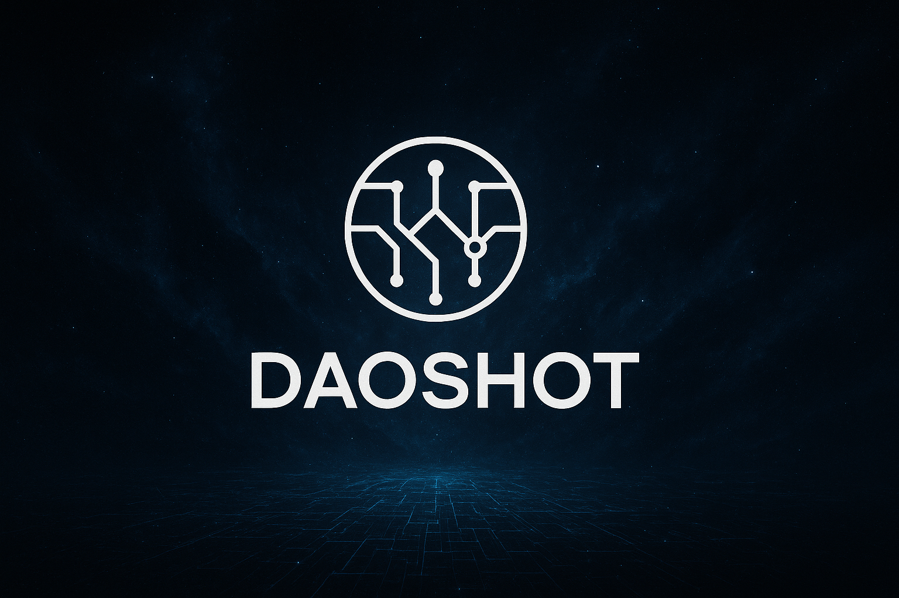

# 👋 你好，我是杨卓

### 北京航空航天大学 | 软件工程专业

**热爱前端开发与创新技术探索 | Web3 & AI 践行者 | 刻熵团队成员**

[English](./README-EN.md) | [中文](./README.md)

---

## 🎓 关于我

我是北京航空航天大学软件工程专业的学生，对前端开发和新兴技术有浓厚兴趣。喜欢挑战自己，不断学习新技术并将其应用于实际项目中。

- 🎂 **年龄**: 20岁 (2005年2月)
- 🏫 **学校**: 北京航空航天大学
- 📚 **专业**: 软件工程
- 👥 **团队**: 刻熵团队 (Keshan Team) 成员

---

## 💻 技术栈

### 编程语言

### 前端技术

### 区块链 & Web3
- **智能合约开发**: Solidity, ERC20/ERC721标准
- **DeFi协议**: 代币部署、流动性管理、EIP712签名
- **NFT & DAO**: NFT合约、DAO治理机制
- **前沿技术**: ZKML (零知识机器学习), Babylon协议

### AI & 机器学习
- **大模型应用**: 模型微调、提示工程
- **RAG技术**: 检索增强生成
- **创新应用**: AI-NPC交互系统、情绪分析

### 后端 & 数据库

### 金融科技
- 量化交易策略、因子分析
- 回测系统、风险检测
- 加密货币交易

### Web3游戏开发
- 全链游戏架构设计
- 钱包支付集成 (MetaMask, 微信支付)
- 链上资产管理、游戏经济模型

---

## 🚀 项目经历

### 🎮 瀛州纪：AI驱动全链Web3游戏 (2025.10-至今)
**Yingzhou Ji: Immortal Ledger | A Fully On-Chain Web3 Game Powered by AI**

创新型全链Web3游戏，将传统游戏玩法与区块链技术深度融合。

**项目地址**: [https://github.com/24373054/Web3-games](https://github.com/24373054/Web3-games)

**核心技术**:
- NFT智能合约开发、ZKML零知识机器学习
- DAO治理机制、AI-NPC交互系统、Babylon协议集成

**创新点**:
- ✨ AI驱动的动态NPC系统
- ⛓️ 完全去中心化的游戏逻辑
- 🔐 ZKML技术保护玩家隐私

---

### 💱 稳定币交易所平台 (2025.10-至今)

基于区块链的去中心化稳定币交易平台，集成智能风险检测与AI交易辅助系统。

**技术架构**:
- EIP712类型化签名验证、ERC20代币标准实现
- 智能合约代币发行与管理、流动性池设计

**AI功能**:
- RAG检索增强生成技术、大模型微调
- 提示工程智能客服、因子分析预测

**安全特性**:
- 多层级钱包交易验证、实时风险检测、异常交易拦截

---

### 📈 AI量化策略交易系统 (2025.10-至今)

智能化加密货币量化交易系统，集成策略开发、回测验证、情绪分析等功能。

**核心模块**:
- 📊 多策略迭代开发框架
- ⚡ 高性能回测引擎
- 🧠 市场情绪分析系统
- 🛡️ 风险管理模块

**创新点**:
- 结合社交媒体情绪分析提高预测准确度
- 自适应策略参数调优

---

### 🎲 Web3点数游戏平台 (2025.10-至今)

创新型Web3休闲游戏平台，支持加密钱包与传统支付双通道。

**支付系统**: MetaMask钱包集成、微信支付API对接、多币种支付

**游戏机制**: 链上积分系统、公平随机数生成、实时结算

---

### 🌐 Matrix Lab 实验室网站 (2025.9)

Matrix Lab区块链与联邦学习研究实验室官方网站开发与部署。

**网站地址**: [https://matrixlab.work/](https://matrixlab.work/)

**技术实现**:
- Jekyll静态站点生成、GitHub Pages自动化部署
- 响应式设计适配多端、LibDoc主题定制

---

### 🔐 加密云盘 (2025.6-2025.8)

安全可靠的云存储解决方案，提供端到端加密保护用户文件隐私。

**特点**: 高强度加密算法、简洁的文件管理界面

---

### 📧 邮件发送系统桌面软件 (2025.5-2025.7)

智能化邮件管理软件，支持群发、定时发送和邮件模板管理。

**功能**: 数据库管理、智能化发送策略、EXE打包分发

---

### 🛒 购物网站 (2025.2-2025.3)

全功能电子商务平台，集成支付系统，提供完整的购物体验。

---

### 💬 树洞网站 (2024.12-2025.2)

匿名社交平台，用户可发帖、评论、加好友和实时聊天。

**功能**: SQL数据库管理、实时聊天系统、好友关系管理

---

### 🤖 论文图片生成AI助手 (2024.11-2025.1)

基于AI技术的论文图表生成工具，帮助研究人员快速创建专业图表。

---

### 🏛️ 校史馆展示平台 (2024.9-2024.12)

为学校设计的校史馆在线展示平台，提供虚拟游览和历史资料查询功能。

**成果**: 🏆 获得走进软件课程优秀奖

---

## 👥 刻熵团队 (Keshan Team)

**刻熵团队**成立于2024年春，来自北京航空航天大学，我们是拥抱AI新技术、探索区块链前沿的创新团队。

### 核心领域
- 🔗 **区块链技术**: 智能合约开发、DeFi协议设计、NFT标准实现、DAO治理机制
- 🌐 **Web3创新**: 全链游戏开发、去中心化交易所、钱包集成、跨链技术
- 🤖 **人工智能**: 大模型微调、RAG技术、AI-NPC系统、ZKML
- 💰 **金融科技**: 量化交易策略、市场情绪分析、风险检测系统、因子模型

### 团队愿景
我们相信，Web3不仅是技术革命，更是价值互联网的基础设施。通过将区块链的信任机制与AI的智能决策深度融合，刻熵团队致力于打造下一代去中心化应用，让每个用户真正拥有自己的数字资产和数字身份。

**刻熵 - 刻录真实，降低熵值，构建Web3时代的有序未来**

---

## 📊 GitHub 统计

---

## 📫 联系我

---

## 🌟 支持我的工作

如果你喜欢我的项目，欢迎 ⭐ Star 支持！

---

### 💡 **"热爱技术，拥抱未来，创造价值"**

**始于Web3，融合AI，不止于此**

---

**© 2025 杨卓. 保留所有权利。**

